# Pudin's Wonderland

Welcome to **Pudin's Wonderland**, a magical place where imagination meets technology. This project is a personal playground for creative experiments, showcasing various skills, tools, and concepts.

## 🌟 Features

- **Interactive Experiences**: Engaging demos and projects that combine fun and functionality.
- **Creative Implementations**: Innovative solutions and ideas brought to life through code.
- **Challenging Boss Battles**: Face unique bosses with varying abilities at different levels.
- **Health and Score System**: Manage health and earn points through gameplay.
- **Immersive Audio**: Sound effects for actions like jumping, collecting coins, defeating enemies, and dying, along with unique music for each level.

## 🦊 Gameplay Mechanics

- **Main Character**: Pudin (the fox) starts with three hearts.
  - Pudin loses one heart each time it gets hit by an enemy.
  - Pudin can regain a heart by collecting a cherry if it has fewer than three hearts.
  - Jumping on top of an enemy defeats it.

<p align="center">
  <figure style="display: inline-block; text-align: center; margin: 10px;">
    <figcaption>Idle Animation</figcaption>
    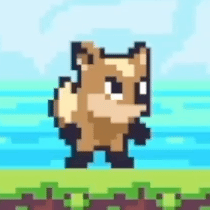
  </figure>
  <figure style="display: inline-block; text-align: center; margin: 10px;">
    <figcaption>Crouch Animation</figcaption>
    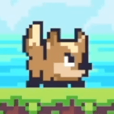
  </figure>
  <figure style="display: inline-block; text-align: center; margin: 10px;">
    <figcaption>Jump Animation</figcaption>
    
  </figure>
</p>

- **Score System**:
  - Gain **10 points** by collecting a cherry.
  - Gain **10 points** by defeating an enemy.
  - If Pudin collects a cherry while missing hearts, the cherry restores a heart instead of adding points.
  <p align="left">
  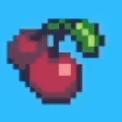
  </p>

## 🐸 Enemies

### Frog (Level 1 and above)
- Moves between left and right boundaries, jumping periodically.
- Uses a ground detection system to trigger jumps.
- Can be defeated by jumping on top of it.
<p align="center">
  <figure style="display: inline-block; text-align: center; margin: 10px;">
    <figcaption>Frog Idle</figcaption>
    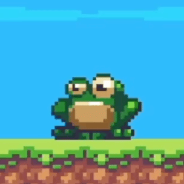
  </figure>
</p>

### Eagle (Level 2 and above)
- Patrols vertically between two set points (top and bottom).
- Uses AI to dynamically reverse direction at boundaries, creating a challenging flight pattern.
- Can be defeated by jumping on top of it.
<p align="center">
  <figure style="display: inline-block; text-align: center; margin: 10px;">
    <figcaption>Eagle Idle</figcaption>
    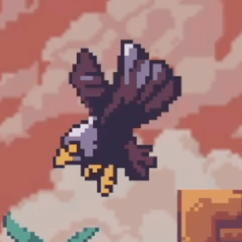
  </figure>
</p>


### Final Boss (Level 3)
- Combines AI and animations to switch behaviors periodically.
- Moves based on the player's position, adding difficulty.
- Takes three hits to defeat and has a health bar displayed on the screen.
- Periodically pauses movement for dramatic attacks.
<p align="center">
  <figure style="display: inline-block; text-align: center; margin: 10px;">
    <figcaption>Boss Stage Change</figcaption>
    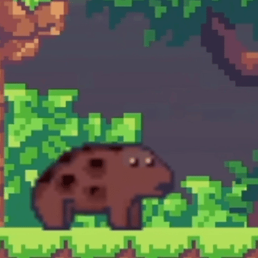
  </figure>
</p>


## 🚀 Getting Started

### Prerequisites

Before you begin, make sure you have the following installed:

- **[Git](https://git-scm.com/)**: For cloning and managing repositories.
- **[Unity](https://unity.com/)**: Version 2020.3.32f1 is required to open and run the project.

### Installation

1. Clone the repository:
   ```bash
   git clone https://github.com/pudding2718/Pudin-s-Wonderland.git
   ```
2. Navigate to the project directory:
   ```bash
   cd Pudin-s-Wonderland
   ```
3. Open the project in Unity:
   - Launch Unity Hub.
   - Click on **Open Project** and navigate to the cloned repository.
   - Ensure you have Unity version 2020.3.32f1 installed.

## 📂 Project Structure

The repository is organized into the following sections:

- **/Assets**: Contains all game assets, including scripts, sprites, and prefabs.
- **/ProjectSettings**: Unity project settings and configurations.
- **/Packages**: Unity packages required for the project.
- **/Docs**: Documentation and additional resources.

## 🖼️ Screenshots

### Level 1
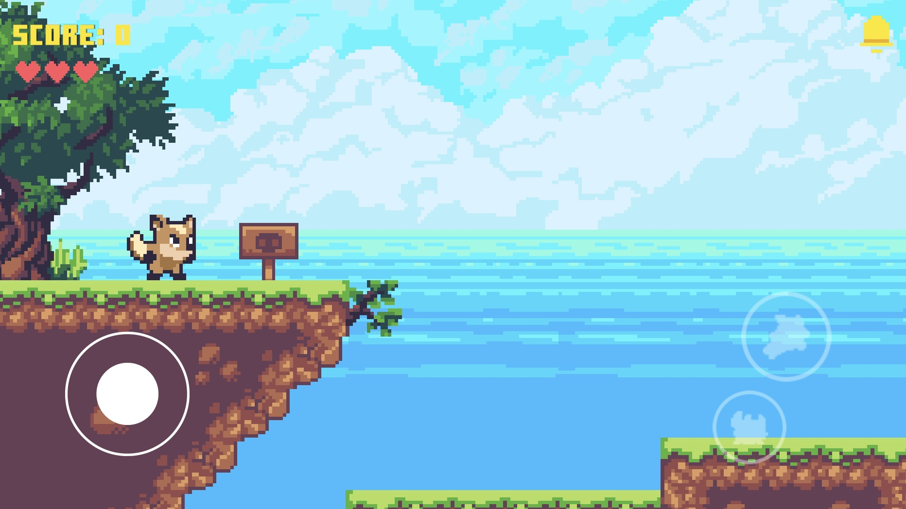

### Level 2


### Level 3
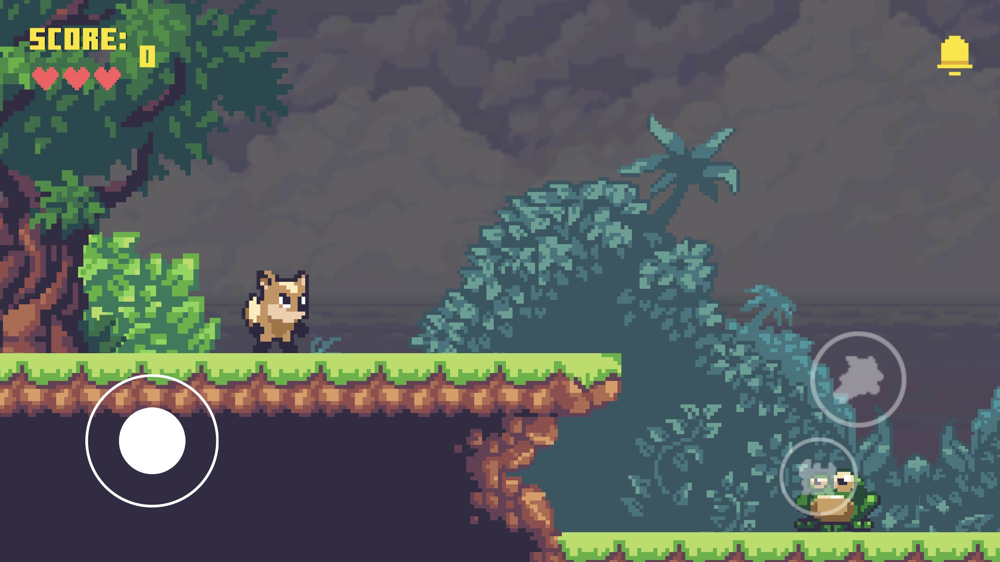

### Main Page
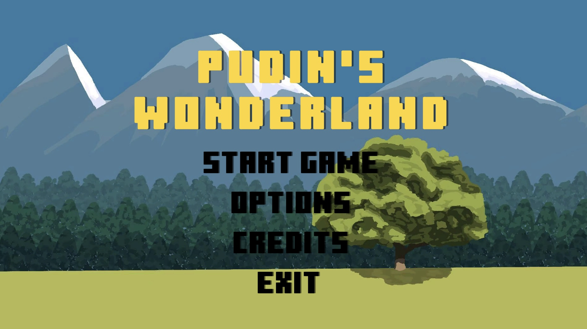

### Pause Page
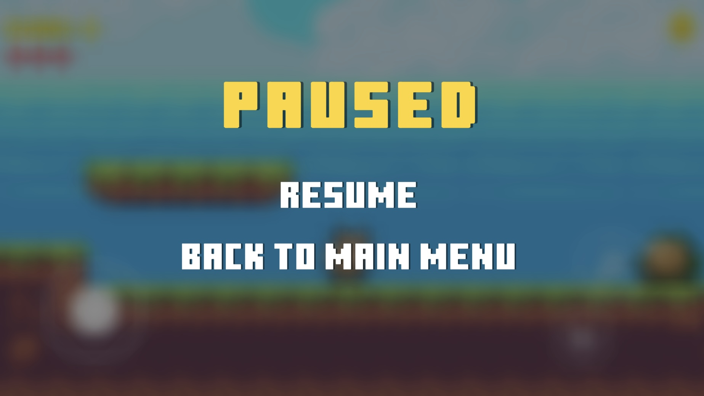

### Setting Page
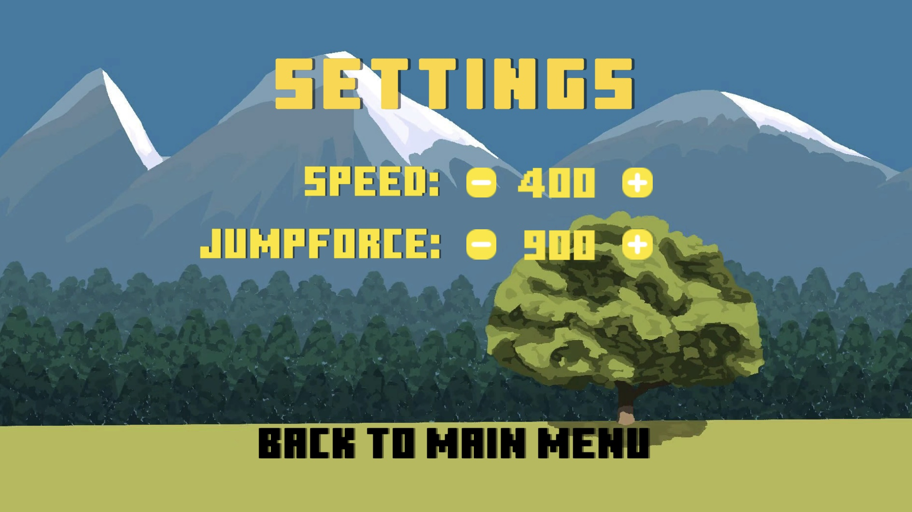

---

